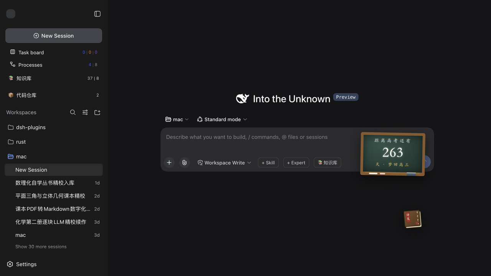
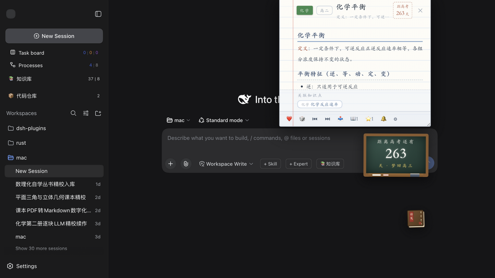

# 梦回高三 · dsh-gaokao

dsh 桌面插件：右下角一块**小黑板**，粉笔字写着"距离高考还有 N 天"（默认自动指向下一届 6 月 7 日，可在设置里自定义考试日期）。点黑板翻开一本练习本，随机抽取一张**知识点卡**；AI 干活（回合结束/工具报错）时黑板也会一震，主动弹出知识点陪你"课间抽背"。

这是一个**开放式知识卡框架**：插件本身只提供运行骨架，知识内容全部是普通 Markdown 文件——按文件夹放好、符合格式就自动加载，任何人都可以贡献学科、或导入自己的知识库。





## 功能

- 🖤 **小黑板倒计时**：每日自算距高考天数，100 天以内数字变红；可拖拽换位
- 📖 **知识卡**：练习本横线纸样式，渲染 Markdown（标题/列表/代码/引用/粗体）
- 🎲 **随机 / ⏮ 上一个 / ⏭ 下一个**（浏览历史前进后退，到顶自动抽新卡）
- ❤ **收藏**（⭐ 收藏夹）与 📥 **复习清单**（掌握了再移出），localStorage 持久化
- 🔗 **关联跳转**：卡片底部"关联知识点" chips + 正文里的 `[[wikilink]]` 都可点击翻卡
- ⚙ **设置**：勾选重点学习学科（只随机这些学科）、自定义高考日期、事件联动开关
- 🔔 **事件联动**：跟随 dsh 会话事件（turn_end / tool_error / 用户发消息）自动弹卡，90 秒防打扰

## 安装

```bash
dsh plugin --profile web add @weibaohui/dsh-gaokao
# 或本地目录
dsh plugin --profile web add /path/to/dsh-gaokao
```

重启 dsh web 后生效（dsh 启动时缓存 client bundle，重建后必须重启）。

## 知识卡格式（贡献指南）

一条知识点 = 一个 `.md` 文件。目录层级即**学科 / 年级**：

```
data/
  物理/高一/牛顿第一定律.md
  数学/高二/等差数列.md
  英语/高二/虚拟语气.md
```

文件内容：

```markdown
---
title: 牛顿第一定律        # 可选，缺省取正文第一个 # 一级标题
subject: 物理              # 可选，缺省取第一级文件夹名
grade: 高一                # 可选，缺省取第二级文件夹名
tags: [力学, 运动学]       # 可选
related: [牛顿第二定律]     # 可选，写卡片标题或 id 均可
---

# 牛顿第一定律

**内容**：一切物体总保持匀速直线运动状态或静止状态……

关联知识点用 [[牛顿第二定律]] 写在正文里也行，会自动变成可点击链接。
```

规则只有几条：

- 跳过 `README.md`、`.` 开头文件和 `_` 开头目录，其余 `.md` 全部加载
- frontmatter 可选；关联（`related` 或 `[[wikilink]]`）按**标题或 id**解析，解析不到的会灰显提示"知识库里还没有这张卡"
- 卡片 id 默认是相对路径（如 `物理/高一/牛顿第一定律`），也可用 frontmatter `id:` 指定
- 改了文件后调 `GET /dsh-gaokao/api/reload` 即热加载，不用重启

### 导入自己的知识库

插件配置里用 `dataDir` 指向你的目录（结构同上）：

```yaml
# ~/.dsh 配置中该插件的 config
config:
  dataDir: /Users/you/my-knowledge-base   # 按 学科/年级/*.md 组织
  examDate: "2027-06-07"                   # 可选，自定义高考日期
```

## HTTP API

| 端点 | 说明 |
|------|------|
| `GET /dsh-gaokao/api/status` | 卡数、学科/年级统计、高考日期与倒计时 |
| `GET /dsh-gaokao/api/draw?subjects=物理,化学&exclude=` | 随机抽一张 |
| `GET /dsh-gaokao/api/bundle?n=30` | 批量随机（客户端本地卡池） |
| `GET /dsh-gaokao/api/card?id=` | 按 id 取整张 |
| `GET /dsh-gaokao/api/reload` | 重新扫描目录 |
| `GET /dsh-gaokao/api/feed?after=N` | 会话事件流（联动用） |

## 开发

```bash
npm run check         # 语法检查
npm test              # node --test（数据加载/关联解析/事件流）
npm run build:client  # client/index.js → client/bundle-mc.js
```

零 npm 运行时依赖；宿主端只用 node 内置模块，客户端经 `require("react")` 工厂注入。

## 致谢

骨架复用自 [dsh-code-poem](https://github.com/weibaohui/dsh-code-poem)（代码如诗）。
