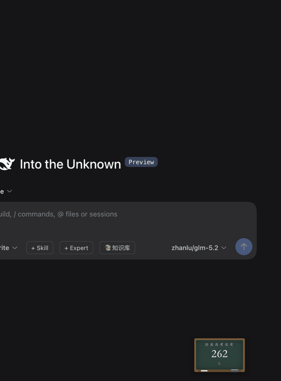

# @weibaohui/dsh-gaokao

> **⚠️ 本项目仅供个人研究学习，不公开发布。** This project is for personal research and study only, not publicly distributed.

[](https://github.com/topics/dsh-plugin)
[](https://www.npmjs.com/package/@weibaohui/dsh-gaokao)

**梦回高三**：右下角浮着一块可拖拽的小黑板，粉笔字写着"距离高考还有 N 天"（双击可收成教室黑板右缘那行竖字）——AI 干活的间隙它自己一震，为你翻开一张练习本知识卡，抽背一个知识点。



## 事件联动

知识卡通过会话事件流感知你在做什么，在恰好的时机递上一张：

| 会话事件 | 弹卡缘起 |
|---|---|
| 回合结束 | 【讲完这题，抽背一个知识点——】 |
| 工具报错 | 【卡壳了？翻翻课本压压惊——】 |
| 回合中止 | 【课间十分钟，来一题——】 |
| 道友提问 | （25% 概率）【老师提问时间到——】 |

防打扰三件套：90 秒内最多自动弹出一次、16 秒无操作自动收起、页脚 🔔 随时可关。联动关闭或页面不可见时**零轮询**，开启时也只 30 秒一轮轻量事件流。

## 核心功能

- **双形态小黑板**：默认是完整黑板（距高考天数，≤100 天数字变红）；**双击黑板**或在 ⚙ 里切换成**竖条收起**——像真正高三教室黑板最右侧那行竖字，只写天数数字，几乎不占地方；形态记忆
- **倒计时日历**：自动指向下一届 6 月 7 日（考完 6 月 10 日滚到下一届），⚙ 里可自定义日期；按住黑板可拖到任意位置


- **缩放自由**：⚙ 里 30%–150% 滑杆等比缩放（默认 60%），持久化
- **练习本纸张**：卡头只有标题；正文底色可选 7 种流行护眼色（豆沙绿/青草绿/杏仁黄/秋叶褐/胭脂红/海天蓝/银河白），格线 4 种样式（横线/方格/点阵/空白），组合出你的专属练习本
- **知识卡**：点黑板翻开练习本，Markdown 渲染（标题/列表/代码/引用/粗体），卡头学科章 + 年级 + 倒计时徽章；右下角拖拽调大小（自动记住）
- **🎲 随机 / ⏮ 上一个 / ⏭ 下一个**：沿浏览历史前进后退，到顶自动再抽新卡；**整副洗牌式**抽卡——一副牌内绝不重复，抽到只剩 2 张才重洗，小知识库也能每轮见遍所有卡
- **❤ 收藏**：重点卡片收藏，⭐ 收藏夹回看；localStorage 持久化
- **关联跳转**：卡片底部"关联知识点" chips 与正文 `[[wikilink]]` 都可点击翻卡，知识库里还没有的卡灰显提示
- **重点学科**：⚙ 勾选想主攻的学科，随机只出选中的；学科章低饱和素色，端庄不花哨
- **开放知识卡框架**：插件只提供运行骨架，内容全是普通 Markdown 文件——按文件夹放好、符合格式就自动加载，任何人可贡献或导入自己的知识库
- **低频批量拉取**：每 5 分钟一次批量取 30 张存本地池，抽卡基本不产生请求压力

## 安装

```bash
dsh plugin --profile web add @weibaohui/dsh-gaokao -w
```

装完重启 `dsh web` 即生效。43 张种子知识卡（语数英物化生历地政 9 学科 × 高一~高三）已随包内置，无需任何配置。

## 使用

1. 打开 Web UI → 右下角找到 **小黑板**，点它翻开知识卡（首次自动抽一张）；拖住黑板可挪位置
2. **双击黑板**收成竖条（只写天数数字），再双击展开；⚙ 里也能切
3. **🎲 随机**：从当前学科范围再抽一张；**⏮/⏭** 在看过的卡之间前进后退
4. **❤ 收藏**：重点知识点收藏；⭐ 打开收藏夹回看
5. ⚙ 挑纸张底色与格线、缩放黑板、勾选重点学科、改高考日期；🔔 开关事件联动

## 知识卡格式（贡献指南）

一条知识点 = 一个 `.md` 文件，目录层级即**学科 / 年级**：

```
data/
  物理/高一/牛顿第一定律.md
  数学/高二/等差数列.md
```

```markdown
---
title: 牛顿第一定律        # 可选，缺省取正文第一个 # 一级标题
subject: 物理              # 可选，缺省取第一级文件夹名
grade: 高一                # 可选，缺省取第二级文件夹名
tags: [力学, 运动学]       # 可选
related: [牛顿第二定律]     # 可选，写卡片标题或 id 均可
---

# 牛顿第一定律

**内容**：一切物体总保持匀速直线运动状态或静止状态……

关联知识点用 [[牛顿第二定律]] 写在正文里也行，会自动变成可点击链接。
```

规则只有几条：

- 跳过 `README.md`、`.` 开头文件和 `_` 开头目录，其余 `.md` 全部加载
- frontmatter 全部可选；关联（`related` 或 `[[wikilink]]`）按**标题或 id** 解析，解析不到的灰显
- 卡片 id 默认是相对路径（如 `物理/高一/牛顿第一定律`），也可用 frontmatter `id:` 指定
- 改了文件后 `curl "http://127.0.0.1:3080/dsh-gaokao/api/reload"` 热刷新，不用重启

### 导入自己的知识库

插件配置里用 `dataDir` 指向你的目录（结构同上）：

```yaml
config:
  dataDir: /Users/you/my-knowledge-base   # 按 学科/年级/*.md 组织
  examDate: "2027-06-07"                   # 可选，自定义高考日期
```

## 开发

```bash
npm run build:client  # 重建 client/bundle-mc.js
npm run check         # 语法检查
npm test              # smoke 测试
```

HTTP API（/dsh-gaokao/api/*）：`/draw` 随机抽一张、`/bundle?n=30` 批量抽取、`/card?id=` 取整张、`/feed?after=N` 会话事件流、`/status`（含高考倒计时）、`/reload`。

发版：`npm version patch && git push --follow-tags`，再 `gh release create vX.Y.Z --generate-notes` 触发 npm Trusted Publishing（OIDC 免 token）。

## 致谢

骨架复用自 [dsh-code-poem](https://github.com/weibaohui/dsh-code-poem)（代码如诗）。

## 联系我 :飞书群


